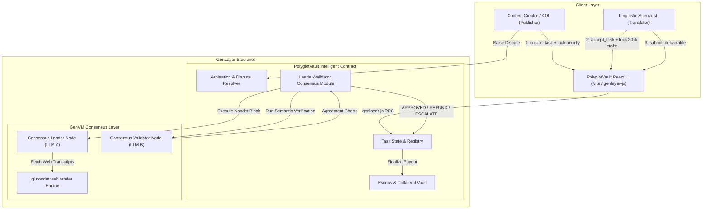
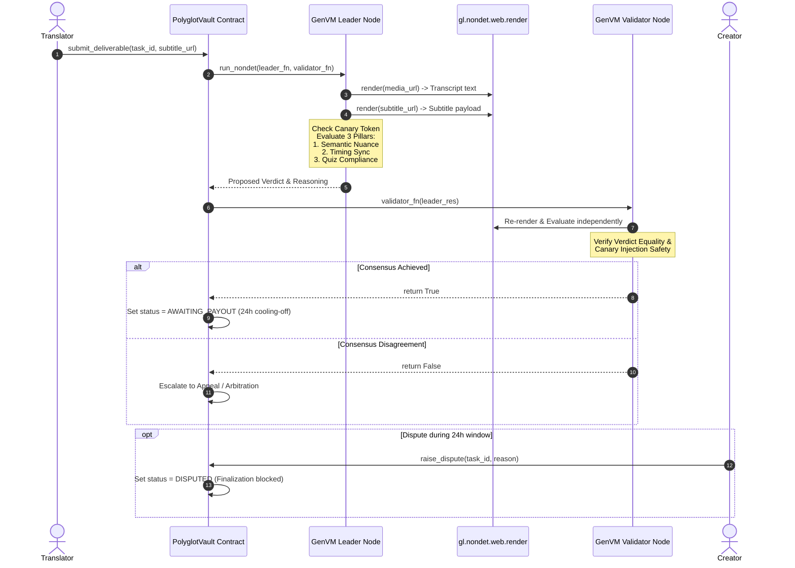
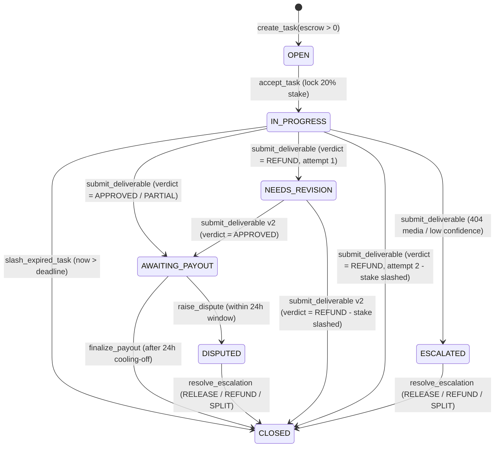

# 🏛️ PolyglotVault Architecture Specification

PolyglotVault combines **Intelligent Contracts**, **Non-Deterministic Web Rendering**, and **Optimistic Democracy Multi-Agent Consensus** to establish a trustless decentralized court for digital video and cinematic subtitle localization.

---

## 1. System Component Architecture

---

## 2. Optimistic Democracy Consensus Pipeline

---

## 3. Complete Task State Machine

